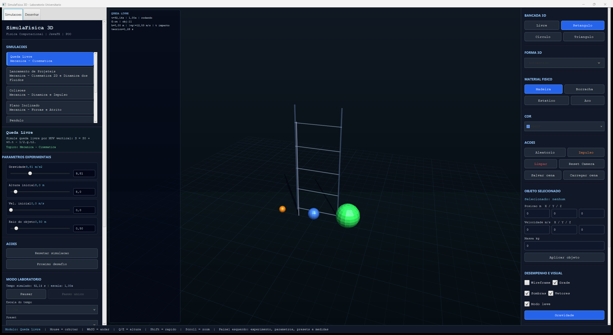
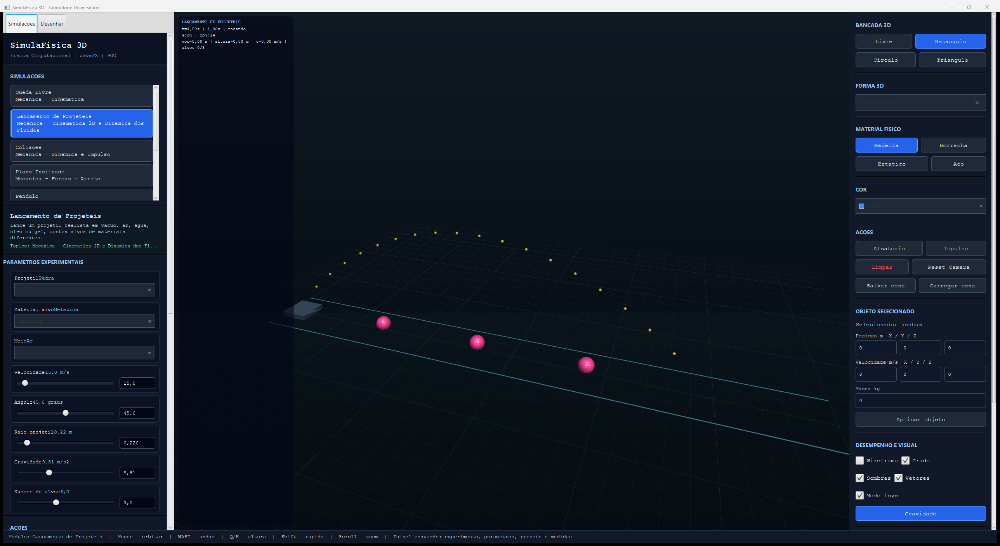
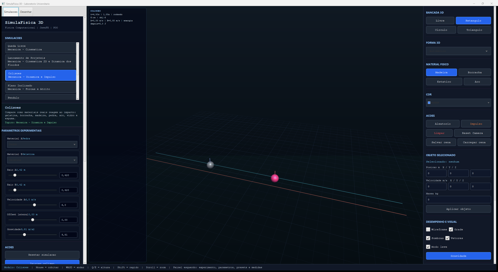
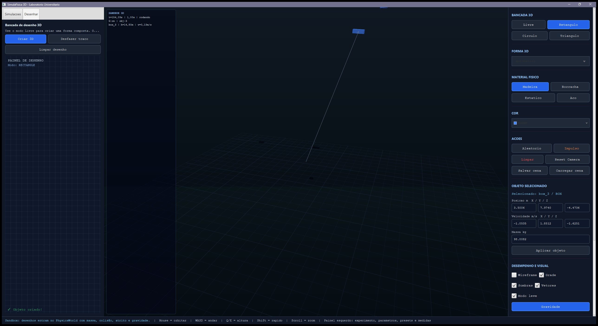
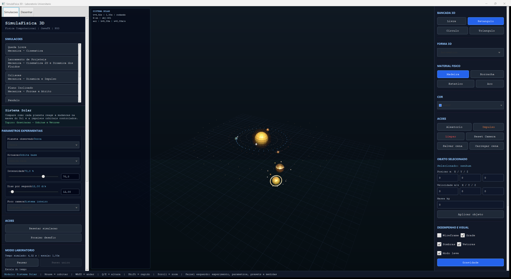
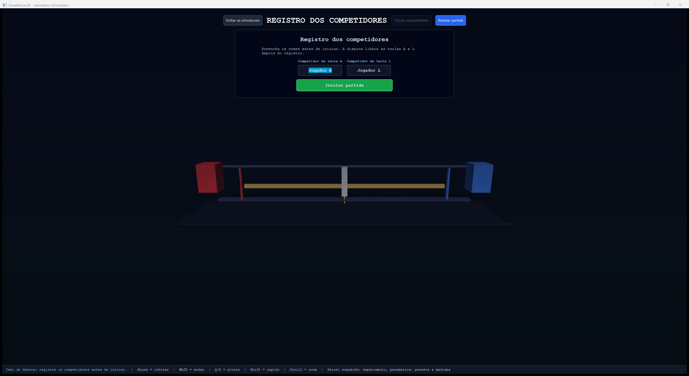

# Prints do Programa e Explicacao das Telas

Este documento mostra as principais telas do SimulaFisica 3D e explica a funcao de cada parte da interface.

## 1. Tela principal - laboratorio 3D



Esta e a tela principal do programa.

O que aparece nela:

- `Painel esquerdo`: lista os modulos de simulacao, mostra a descricao do modulo selecionado e exibe os parametros editaveis.
- `Cena 3D central`: mostra os objetos simulados, a grade do ambiente, vetores, trajetorias e resultados visuais.
- `HUD superior`: mostra dados resumidos da simulacao, como tempo, gravidade, velocidade e estado do experimento.
- `Painel direito`: permite criar objetos, escolher materiais, alterar cor, editar objeto selecionado, ligar/desligar gravidade, grade, sombras e vetores.
- `Rodape`: mostra atalhos de camera e navegacao, como mouse para orbitar, WASD para andar, Q/E para alterar altura e scroll para zoom.

Nesta tela, o modulo ativo e `Queda Livre`. Ele demonstra Movimento Uniformemente Variado, usando gravidade para mostrar altura, velocidade e impacto com o chao.

## 2. Lancamento de projeteis



Esta tela mostra o modulo de lancamento de projeteis.

O que cada parte faz:

- `Material do projetil`: define de que material o objeto lancado e feito, influenciando massa e resposta ao impacto.
- `Material alvo`: define como o alvo reage ao impacto, por exemplo gelatina, vidro, pedra ou aco.
- `Meio`: altera o ambiente do lancamento, como ar, agua, oleo, gel ou vacuo.
- `Velocidade`: controla a velocidade inicial do projetil.
- `Angulo`: controla a inclinacao do lancamento.
- `Gravidade`: altera a aceleracao vertical.
- `Alvos`: permite comparar impactos em um ou mais alvos.

Na cena 3D, a trajetoria aparece em pontos amarelos. A curva demonstra o movimento bidimensional do projetil sob gravidade e, dependendo do meio, tambem com arrasto.

## 3. Colisoes com materiais



Esta tela mostra a simulacao de colisoes.

O que ela demonstra:

- dois corpos com materiais diferentes;
- massa calculada a partir de densidade e tamanho;
- velocidade inicial;
- impacto entre os objetos;
- perda ou conservacao parcial de energia;
- resposta diferente conforme dureza, atrito, amortecimento e restituicao.

Exemplo de uso em apresentacao:

```text
Se o material A for pedra e o material B for gelatina, a colisao deve se comportar de forma diferente de aco contra vidro.
```

O modulo serve para explicar impulso, quantidade de movimento, energia e comportamento aproximado dos materiais.

## 4. Desenho livre convertido em objeto 3D



Esta tela mostra a aba `Desenhar`.

O que acontece nela:

- o usuario desenha no painel 2D;
- o desenho e transformado em uma forma 3D;
- a forma entra no `PhysicsWorld`;
- o objeto passa a ter massa, velocidade, gravidade, colisao e material;
- o usuario pode selecionar, mover e alterar propriedades do objeto.

No print, o objeto criado aparece na cena 3D com vetor/linha de movimento. Isso mostra que o desenho nao fica apenas como imagem: ele vira um objeto dentro da engine.

## 5. Sistema Solar



Esta tela mostra o modulo `Sistema Solar`.

O que aparece:

- Sol no centro da simulacao;
- planetas com orbitas visuais;
- texturas planetarias;
- satelites naturais em escala visual comprimida;
- parametros para escolher planeta observado;
- situacoes como orbita base, alteracao de massa solar ou perturbacoes.

Esse modulo demonstra gravidade, orbitas, vetores e rotacao em um ambiente 3D. Ele nao usa escala real completa porque isso deixaria as distancias impossiveis de visualizar em tela; por isso a escala visual e comprimida para fins didaticos.

## 6. Cabo de guerra



Esta tela mostra a atividade interativa da feira.

O que ela faz:

- registra o nome dos dois competidores;
- o jogador da esquerda usa a tecla `A`;
- o jogador da direita usa a tecla `L`;
- quem pressiona mais rapido aplica mais forca;
- o cabo se desloca conforme a diferenca de desempenho;
- o sistema registra cliques, velocidade de clique e ranking.

O cabo de guerra nao e uma simulacao fisica completa como os modulos de laboratorio. Ele e uma atividade interativa que usa a ideia de forca aplicada ao longo do tempo para tornar a apresentacao mais participativa.

## Resumo da interface

| Parte da tela | Funcao |
| --- | --- |
| Painel esquerdo | Escolher simulacao, alterar parametros, iniciar/resetar experimento e ver resultados |
| Cena 3D | Visualizar objetos, trajetorias, colisao, gravidade, orbitas e movimento |
| Painel direito | Criar objetos, escolher materiais, editar objeto selecionado e controlar visual |
| HUD | Mostrar medidas principais em tempo real |
| Rodape | Mostrar atalhos de camera e estado atual |
| Aba Desenhar | Transformar desenho 2D em objeto 3D fisico |
| Cabo de guerra | Atividade interativa com competidores, teclas e ranking |

